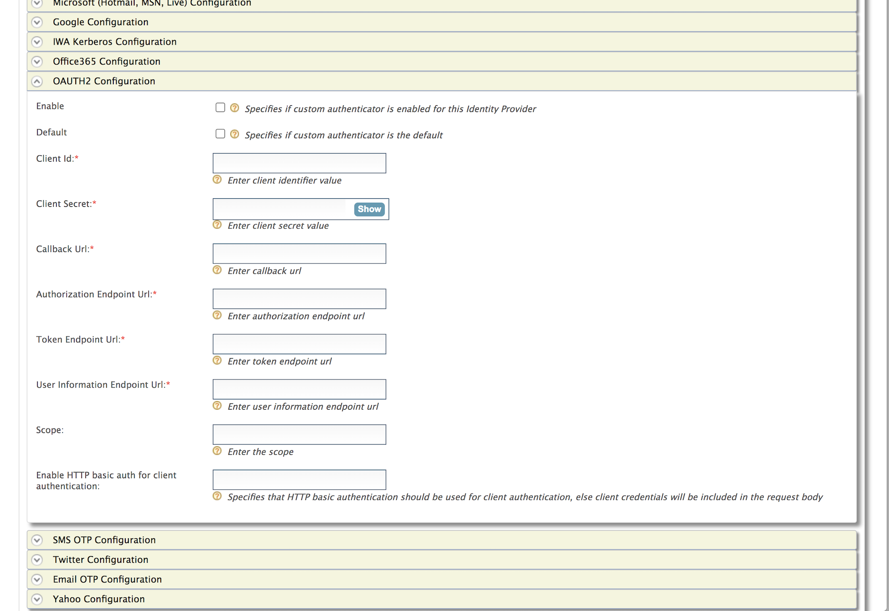
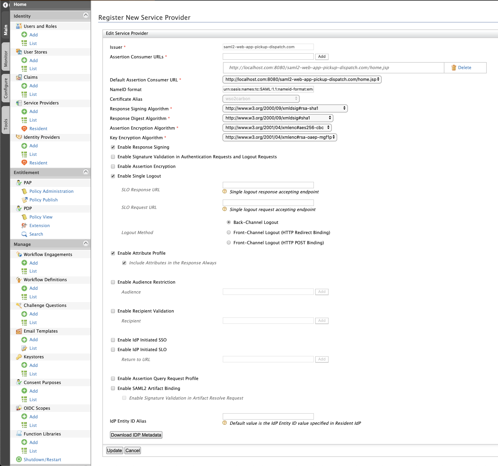
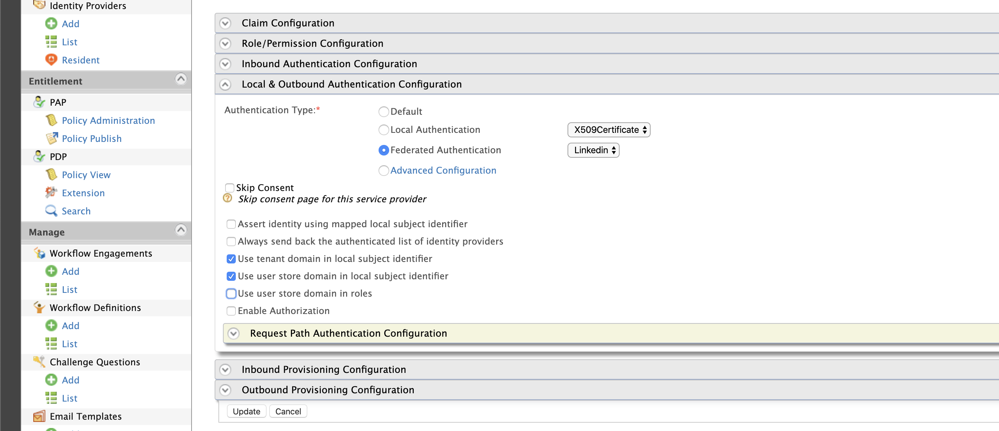
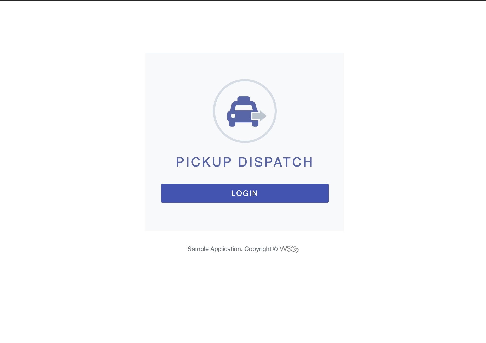
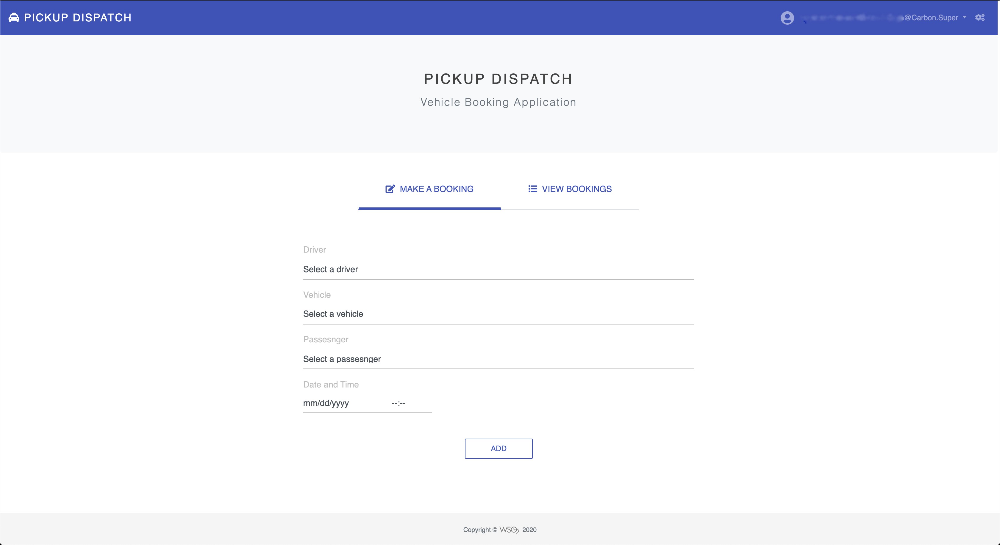

# Configuring Oauth2 Generic Authenticator

This page provides instructions on how to configure the Oauth2 Generic  
authenticator as a connector, and the WSO2 Identity Server using a sample app to 
demonstrate authentication. Also, this page provides instructions on how to use this to build more specific Oauth2
 Connectors extending this implementation.

>The Oauth2 Authenticator, is supported from WSO2 Identity Server 5.10.0 onwards.

##Oauth2 Generic Authenticator as a Federated Authentication Connector

Follow the steps given below to set this up.

* [Step 1 - Configure the Oauth App](#step-1---configure-the-Oauth-App)
* [Step 2 - Deploy the Pickup Dispatch Sample Web App](#step-2---deploy-the-pickup-dispatch-sample-web-app)
* [Step 3 - Configure the Identity Provider (IdP)](#step-3---configure-the-identity-provider-idp)
* [Step 4 - Configure the Service Provider](#step-4---configure-the-service-provider)
* [Step 5 - Test the Sample Application](#step-5---test-the-sample-application)

## Step 1 - Configure the Oauth App

Create a new application in external Oauth2 Identity Provider, and obtain client ID and client Secret.

## Step 2 - Deploy the Pickup Dispatch Sample Web App

Deploy the Pickup Dispatch sample web app in order to use it in this scenario.

To configure this, see [saml2-web-app-pickup-dispatch 
webapp](https://is.docs.wso2.com/en/5.9.0/learn/deploying-the-sample-app/#deploying-the-saml2-web-app-pickup-dispatch-webapp).

## Step 3 - Configure the Identity Provider (IdP)

1. Place the Oauth authenticator.jar file into the 
`<IS_HOME>/repository/components/dropins` directory. 
You can download the .jar file 
from the [WSO2 Store](https://store.wso2.com/store/assets/isconnector/list). 

2. Start the WSO2 Identity Server

3. Next, add a new identity provider in WSO2 Identity Server [adding a new identity 
provider](https://is.docs.wso2.com/en/5.9.0/learn/adding-and-configuring-an-identity-provider/#adding-and-configuring-an-identity-provider).

    a. Log in to the [Management Console](https://is.docs.wso2.com/en/5.9.0/setup/getting-started-with-the-management
-console/) 
as an administrator.

    b. In the **Identity Providers** section under the **Main** tab of the management console, click **Add**.

    c. Enter a suitable name as the **Identity Provider Name** (e.g., auth).
    >As our resident Identity Provider is
 WSO2 IS, the Alias will appear as follows - `https://(host-name):(port)/oauth2/token`
   
    d. Navigate to the **OAUTH2 Authenticator Configurations** under **Federated Authenticators**.

    e. Enter the IdP related details as follows.
    
    
| Field | Description | Sample Value |
| ------------- | ------------- | ------------- |
|Enable	|Selecting this option enables Oauth2 Identity Provider to be used as an authenticator for users provisioned to the Identity Server|	Selected
|Default|Selecting the Default checkbox signifies that Naver is the main/default form of authentication. This removes the selection made for any other Default checkboxes for other authenticators.|	Selected
|Client Id	|This is a unique public identifier for apps which is usually given as a 32-character hex string. Enter the client ID of the app that you created in IdP.|	81b05d91toz66e
|Client Secret|	This is a secret known only to the application and the authorization server. Enter the client secret of the app that you created in IdP.|	otYR21HMW1PchfwZ
|Callback URL|	This is the URL to which the browser should be redirected after the authentication is successful. It should have this format: https://(host-name):(port)/commonauth	| https://localhost:9443/commonauth
|Authorization Endpoint URL|This is used to interact with the resource owner and get the authorization code to access the protected resource.| https://localhost:9444/oauth2/authorize|
|Token Endpoint URL| This is use to obtain an access token by giving an authorization code 	| https://localhost:9444/oauth2/token|
|User Information Endpoint URL|This is a resource that returns Claims about the authenticated End-User.	| https://localhost:9444/oauth2/userinfo|
|Scope|This is a space-delimited list of permissions that requires to authorize the access to a user's details.	| openid |
|Enable HTTP basic auth for client authentication|This specifies that HTTP basic authentication should be used for client authentication, else client credentials will be included in the request body | true|
|Enable retrieving user claims via self-contained access token| This Specifies that self-contained access token should be used for retrieve user claims, else userinfo endpoint will be used for retrive user information| true|

   
   
    
   f. Click on **Register**.

You have now added the identity provider.

## Step 4 - Configure the Service Provider

The next step is to configure the service provider on the WSO2 Identity Server.

> If you have created a service provider already in Step 2, Skip to step 5.f.

1. Return to the management console.

2. In the **Service Providers** section under the **Main** tab, click **Add**.

3. As you are using **saml2-web-app-pickup-dispatch** as the sample, enter **saml2-web-app-pickup-dispatch.com** in the **Service Provider
 Name** text box and click **Register**.

4. In the **Inbound Authentication Configuration** section, click **SAML2 Web SSO Configuration**, and then click **Configure**.

5. Add the service provider details as follows.
    
    a. Select Mode: Manual Configuration
       
      > For more information on the SAML2 Web Single-Sign-On Configuration methods, see [Configuring SAML2 Web Single
       -Sign-On](https://is.docs.wso2.com/en/latest/learn/configuring-single-sign-on-saml/) in the WSO2 IS 5.9.0
       guide.
    
    b. Issuer: saml2-web-app-pickup-dispatch
    
    c. Assertion Consumer URL: Enter `http://localhost.com:8080/saml2-web-app-pickup-dispatch.com/home.jsp` and click
     **Add**.
    
    d. Select the following check-boxes.
    
        * Enable Response Signing.
        * Enable Single Logout.
        * Enable Attribute Profile.
        * Include Attributes in the Response Always.
    
    
    
    e. Click **Register** to save the changes. Now you will be sent back to the **Service Providers** page.
    
    f. Go to the **Local and Outbound Authentication Configuration** section.
    
    g. Configure the Local and Outbound Authentication for Oauth2.
    
    > For more information, see Configuring [Local and Outbound Authentication for a Service 
    Provider](https://is.docs.wso2.com/en/latest/learn/configuring-local-and-outbound-authentication-for-a-service)
                                                                                                                                                                                                                                                                                                                                                                                                                                                                                                                                                                                                                                                                                                                                                                                                                                                                                                                                                                                                                                                                                                                                        >-provider/) 
    in the WSO2 Identity 5.10.0 guide.

        I. Click on the **Federated Authentication** radio button.
        II. Select the identity provider you created from the drop-down list under **Federated Authentication**. 
        III. Select the following options.
            * Use tenant domain in local subject identifier.
            * Use user store domain in local subject identifier.
            
    
            
    h. Click **Update** to save the changes.
    

## Step 5 - Test the Sample Application

1. To test the sample, go to the following URL: 
`http://<TOMCAT_HOST>:<TOMCAT_PORT>/saml2-web-app-pickup-dispatch.com/index.jsp`.
    
    Example: `http://localhost:8080/saml2-web-app-pickup-dispatch.com/index.jsp`
    
    

2. Click the link to log in with SAML from WSO2 Identity Server. You can use either the **Redirect Binding** or the **Post
 Binding** option.
 
3. You will be redirected to the Oauth2 Identity Provider sign in page. Enter your Oauth2 Identity Provider
 user credentials.
    
4. Give the permission to the created Oauth2 application to access the Oauth2 Identity Provider account and get the
 required claims.

5. Give the consents to get the displayed claims to WSO2 Identity Server and Approve it.
    
6. After you are successfully authenticated, you will be taken to the home page of the saml2-web-app-pickup-dispatch.com
 app.

    
    
##Extending Oauth2 Generic Authenticator to build Specific Oauth2 Connector

1. Create a Maven Project for New Connector Implementation. 

2. Place the Oauth authenticator.jar file into the 
   `<Maven_Project_Home>/components/<Component_name>/src/main/resources` directory. 
   You can download the .jar file 
   from the [WSO2 Store](https://store.wso2.com/store/assets/isconnector/list). 

3. Add that JAR as a dependency in pom.xml
<dependency>
    <groupId>org.wso2.carbon.identity.outbound.auth.oauth2</groupId>
    <artifactId>identity-outbound-oauth-oauth2</artifactId>
    <scope>system</scope>
    <systemPath>
        ${project.basedir}/src/main/resources/org.wso2.carbon.identity.application.authenticator.oauth2-1.0-SNAPSHOT.jar
    </systemPath>
    <version>${oauth2.outbound.version}</version>
</dependency>
           
4. Implement and build the connector
           
5. Place the specific connector .jar file into the `<IS_HOME>/repository/components/dropins` directory.
           
6. Place the Oauth authenticator .jar file into the `<IS_HOME>/repository/components/lib` directory.